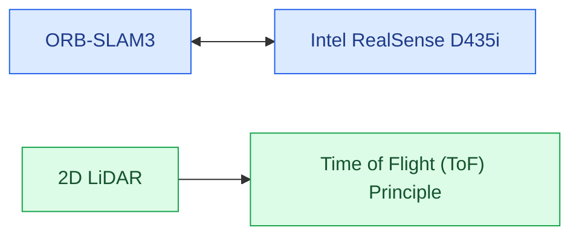
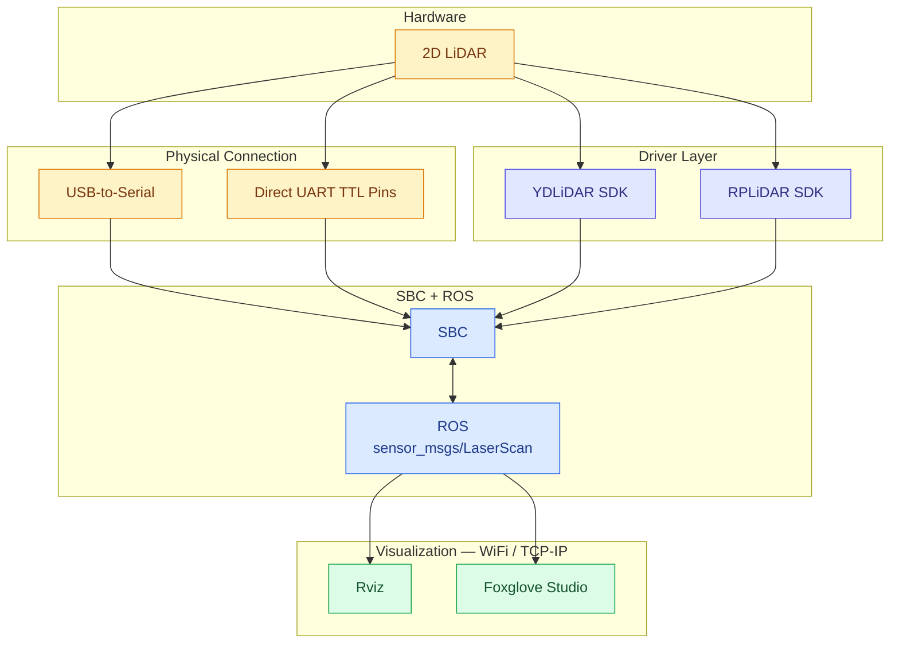
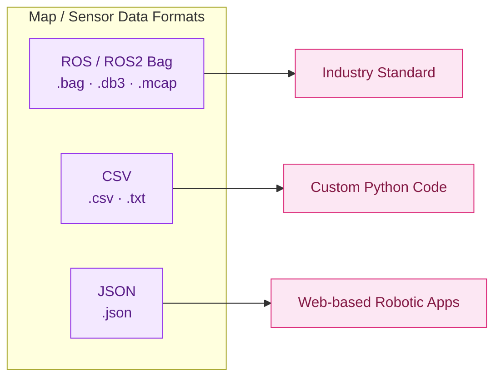
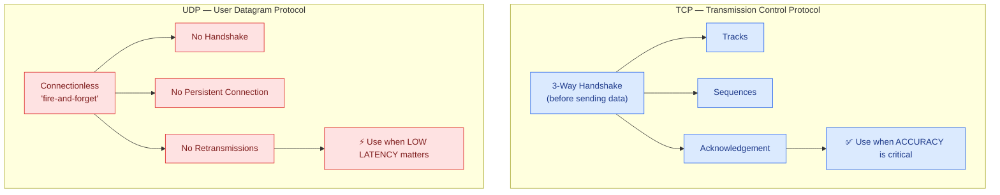

# Autonomous Drone Pipeline — SLAM, LiDAR & Networking Reference

---

## 1. Sensor Stack



---

## 2. LiDAR → SBC → ROS → Visualization Pipeline



---

## 3. Data Format Cheat Sheet



| Format | Extension(s) | Best For |
|:---|:---:|:---|
| ROS / ROS2 Bag | `.bag` `.db3` `.mcap` | Industry standard |
| CSV | `.csv` `.txt` | Custom Python code |
| JSON | `.json` | Web-based robotic apps |

**Custom Python setup:**
```bash
pip install pyserial rplidar-roboticia
```

---

## 4. TCP vs UDP



| | **TCP** | **UDP** |
|---|:---:|:---:|
| Connection | Handshake-based | Connectionless |
| Reliability | Guaranteed / ordered | Best-effort |
| Retransmission | ✅ Yes | ❌ No |
| Overhead | High | Low |
| Ideal Use | Accuracy-critical data | Low-latency streaming |

---

*Digitized from handwritten lab notebook for GitHub reference.*
