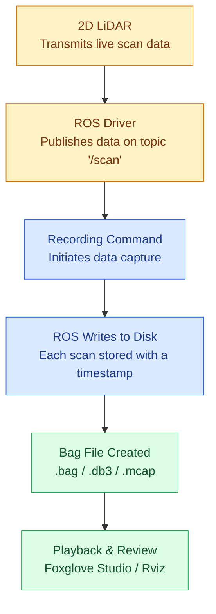
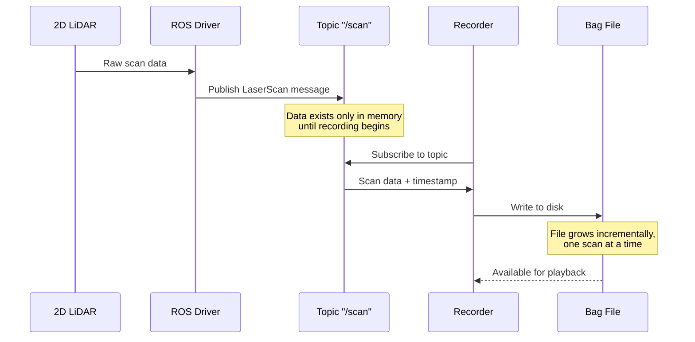
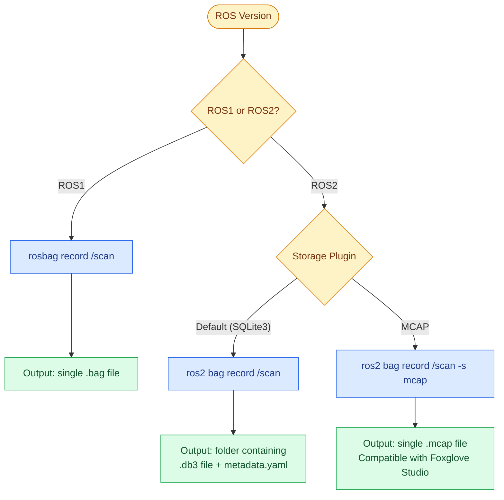
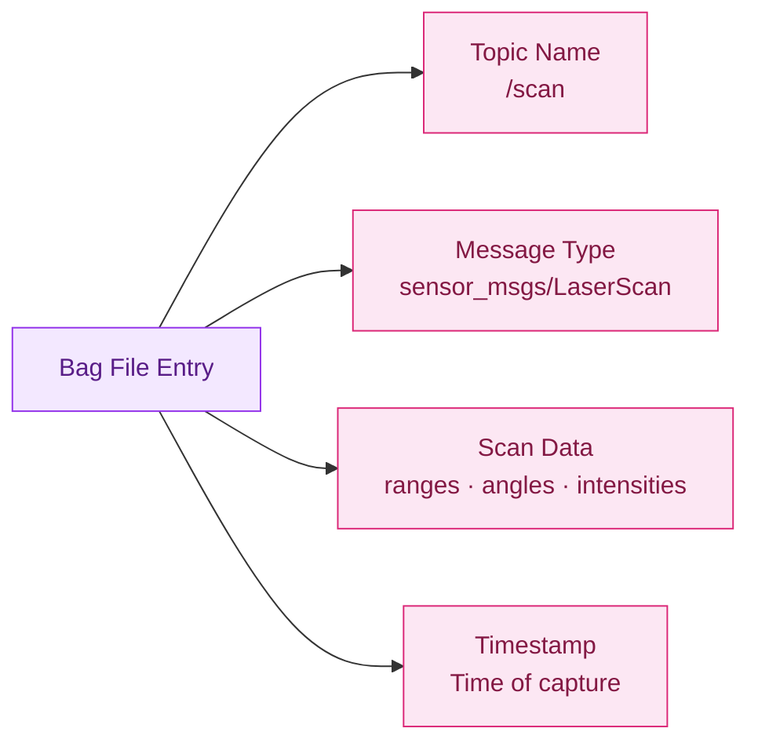
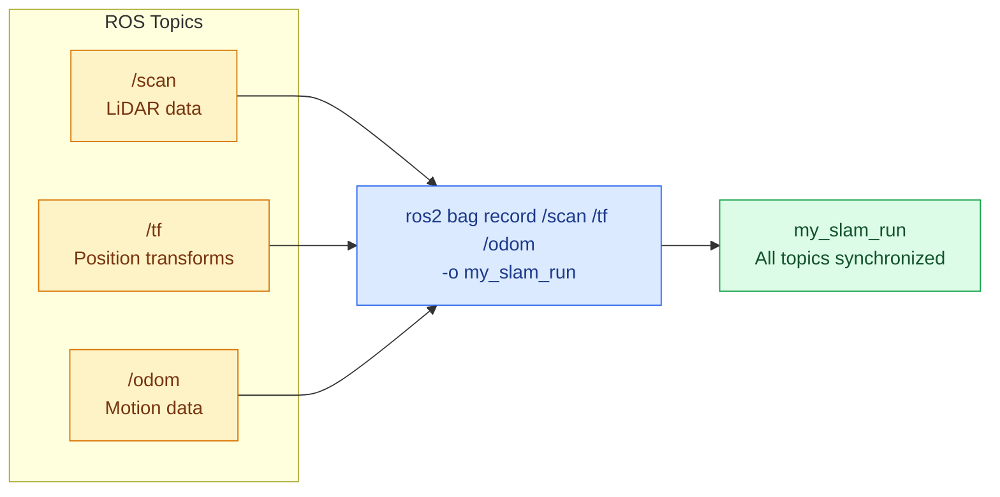
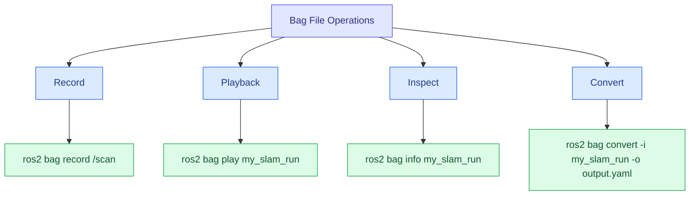

# ROS Recording Workflow - Drone LiDAR Data

This document explains how live 2D LiDAR data from a drone's companion computer is captured and saved as a file using ROS. Each section pairs a short explanation with a diagram to make the process clear for readers new to ROS.

---

## 1. Overview

A LiDAR sensor does not save data on its own — it only transmits a continuous stream of readings. ROS, running on the companion computer, listens to this stream and records it to disk when instructed. The diagram below outlines the complete process, from sensor output to a file that can be replayed later.

---

## 2. Data Flow Sequence

The sequence diagram below shows the same process viewed as a timeline of interactions. Data remains transient — visible only in memory — until a recording process actively subscribes to the topic and begins writing it to storage.

---

## 3. Selecting a File Format

The resulting file format depends on the ROS version in use and, for ROS2, the storage plugin selected at recording time.

| ROS Version | Command | Output |
|:---|:---|:---|
| ROS1 | `rosbag record /scan` | Single `.bag` file |
| ROS2 (default) | `ros2 bag record /scan` | Folder with `.db3` + `metadata.yaml` |
| ROS2 (MCAP) | `ros2 bag record /scan -s mcap` | Single `.mcap` file |

---

## 4. Bag File Contents

Each recorded scan stores four pieces of information: the topic it originated from, its message type, the sensor readings themselves, and the exact time it was captured.

---

## 5. Recording Multiple Topics (SLAM Use Case)

A LiDAR scan alone does not indicate the position of the drone at the time of capture. For SLAM (mapping), the LiDAR topic must be recorded alongside position and motion data so that all sources remain synchronized during playback.

---

## 6. Command Reference

Once a bag file exists, four operations cover most use cases: recording, playback, inspection, and format conversion.

| Task | Command |
|:---|:---|
| Start recording | `ros2 bag record /scan` |
| Replay recording | `ros2 bag play my_slam_run` |
| Inspect contents | `ros2 bag info my_slam_run` |
| Convert format | `ros2 bag convert -i my_slam_run -o output.yaml` |

---

## Summary

- A LiDAR only transmits live data — it does not store anything independently.
- ROS captures this data through a **topic** and writes it to a **bag file** when recording is active.
- The output format (`.bag`, `.db3`, `.mcap`) depends on the ROS version and storage plugin used.
- For SLAM applications, record the LiDAR topic together with position data (`/tf`, `/odom`) to keep them synchronized.
- Bag files can be replayed, inspected, or converted to other formats at any time after recording.

---

*Reference documentation compiled from project notes.*
