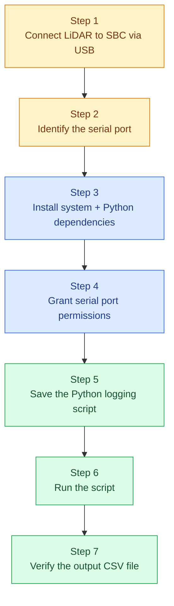
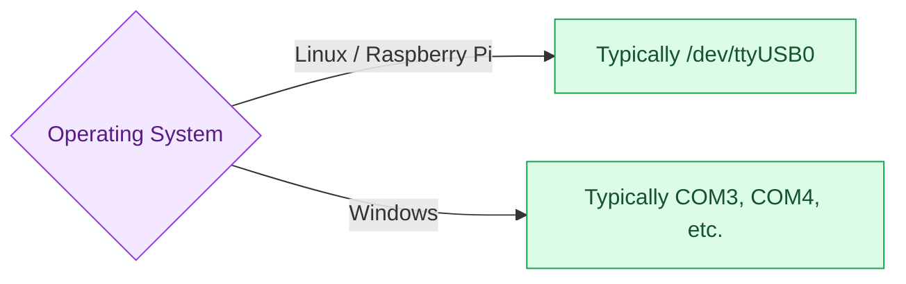
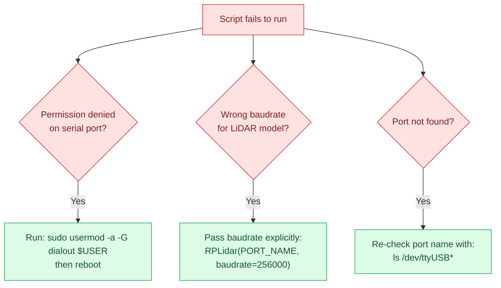
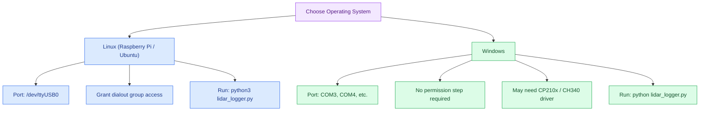

# CSV / Python Workflow - 2D LiDAR Data Logging

This document provides a complete, executable workflow for capturing 2D LiDAR data on a companion computer (e.g. Raspberry Pi) and saving it directly to a CSV file using Python — without ROS. It is written so a reader can start from a blank system and reach a working setup by following the steps in order.

---

## 1. Workflow Overview



---

## 2. Prerequisites

| Requirement | Detail |
|:---|:---|
| Hardware | 2D LiDAR (e.g. RPLidar A1/A2/C1) connected via USB to the SBC |
| Operating System | Linux (Raspberry Pi OS / Ubuntu) or Windows |
| Python | Version 3.7 or later |
| Permissions | User account access to the serial port (Linux only) |

Verify Python is installed before proceeding:

```bash
python3 --version
```

---

## 3. Step 1 — Connect the LiDAR

Connect the LiDAR to the SBC using its USB adapter cable. No software action is required at this stage — this step simply confirms the physical connection before configuration begins.

---

## 4. Step 2 — Identify the Serial Port

The script needs to know which port the LiDAR is connected to.



To confirm the exact port on Linux, run:

```bash
ls /dev/ttyUSB*
```

On Windows, check **Device Manager → Ports (COM & LPT)**.

---

## 5. Step 3 — Install Dependencies

Two Python libraries are required: `pyserial` (serial communication) and `rplidar-roboticia` (LiDAR driver).

**Linux (Raspberry Pi OS / Ubuntu):**
```bash
pip install pyserial rplidar-roboticia --break-system-packages
```

> The `--break-system-packages` flag is only needed if `pip` refuses to install due to an "externally managed environment" error (common on newer Raspberry Pi OS / Debian releases).

**Windows:**
```bash
pip install pyserial rplidar-roboticia
```

> No special flags are required on Windows.

---

## 6. Step 4 — Grant Serial Port Permissions (Linux Only)

On Linux, a standard user account may not have permission to access USB serial devices by default. Run the following once, then reboot:

```bash
sudo usermod -a -G dialout $USER
sudo reboot
```

This step is not required on Windows.

---

## 7. Step 5 — Save the Logging Script

Create a file named `lidar_logger.py` and paste in the following code. Update `PORT_NAME` in the configuration section to match the port identified in Step 2.

```python
import csv
import time
import sys
from rplidar import RPLidar, RPLidarException

# --- CONFIGURATION ---
# Change to 'COM3', 'COM4' if on Windows. On Linux/Pi, it is usually '/dev/ttyUSB0'
PORT_NAME = '/dev/ttyUSB0'
OUTPUT_FILE = 'lidar_scan_data.csv'

def run_lidar_logger():
    # Initialize the LiDAR connection
    print(f"Connecting to LiDAR on port {PORT_NAME}...")
    try:
        lidar = RPLidar(PORT_NAME)
        info = lidar.get_info()
        print(f"Connected successfully! Device Info: {info}")
    except Exception as e:
        print(f"Failed to connect to LiDAR: {e}")
        sys.exit(1)

    # Open the CSV file and write the headers
    print(f"Saving scan logs to '{OUTPUT_FILE}'. Press Ctrl+C to stop.")
    with open(OUTPUT_FILE, mode='w', newline='') as file:
        writer = csv.writer(file)

        # Write CSV columns based on core 2D LiDAR parameters
        writer.writerow(['Timestamp', 'Scan_ID', 'Quality', 'Angle_Degrees', 'Distance_Meters'])

        scan_counter = 0
        try:
            # iter_scans() yields a full 360-degree rotation array per iteration
            for scan in lidar.iter_scans():
                scan_counter += 1
                current_time = time.time()  # Grab exact Unix timestamp

                # Loop through each individual laser point in the 360-degree scan array
                for (quality, angle, distance) in scan:
                    # Ignore invalid zero readings or out-of-range sensor noise
                    if distance > 0:
                        # Convert millimeters (standard LiDAR raw output) to meters
                        distance_meters = distance / 1000.0

                        # Append the parsed data point straight into our flat row CSV file
                        writer.writerow([
                            f"{current_time:.4f}",     # Precise time
                            scan_counter,              # Group ID for this rotation loop
                            quality,                   # Signal strength (0-15 or 0-63)
                            f"{angle:.2f}",            # Angular heading in degrees
                            f"{distance_meters:.3f}"   # Normalized range in meters
                        ])

                # Flush internal buffer periodically so data saves progressively
                if scan_counter % 5 == 0:
                    file.flush()
                    print(f"Logged {scan_counter} complete rotations...", end='\r')

        except KeyboardInterrupt:
            print("\nRecording stopped by user via Ctrl+C.")
        except RPLidarException as re:
            print(f"\nLiDAR hardware exception encountered: {re}")
        finally:
            # Crucial cleanup: Always gracefully stop the spinning motor and release serial locks
            print("Stopping motor and disconnecting device cleanly...")
            lidar.stop()
            lidar.stop_motor()
            lidar.disconnect()

if __name__ == '__main__':
    run_lidar_logger()
```

---

## 8. Step 6 — Run the Script

**Linux:**
```bash
python3 lidar_logger.py
```

**Windows:**
```bash
python lidar_logger.py
```

Expected console output on success:

```
Connecting to LiDAR on port /dev/ttyUSB0...
Connected successfully! Device Info: {...}
Saving scan logs to 'lidar_scan_data.csv'. Press Ctrl+C to stop.
Logged 5 complete rotations...
```

Press **Ctrl+C** at any time to stop recording. The script will stop the LiDAR motor and close the connection cleanly before exiting.

---

## 9. Step 7 — Verify the Output

A file named `lidar_scan_data.csv` will be created in the same directory as the script. Each row represents one measured point.

| Timestamp | Scan_ID | Quality | Angle_Degrees | Distance_Meters |
|:---|:---:|:---:|:---:|:---:|
| 1718223541.1042 | 1 | 15 | 0.42 | 1.245 |
| 1718223541.1042 | 1 | 15 | 1.15 | 1.251 |
| 1718223541.2215 | 2 | 14 | 0.05 | 1.242 |

| Column | Meaning |
|:---|:---|
| `Timestamp` | Unix time the point was recorded |
| `Scan_ID` | Groups all points belonging to the same 360° rotation |
| `Quality` | Signal strength of the return (higher is more reliable) |
| `Angle_Degrees` | Heading of the beam at time of measurement |
| `Distance_Meters` | Measured distance, converted from mm to meters |

---

## 10. Troubleshooting



| Issue | Cause | Fix |
|:---|:---|:---|
| `Permission denied` on serial port | User account lacks access to `/dev/ttyUSB0` | `sudo usermod -a -G dialout $USER`, then reboot |
| Connection fails / garbled data | Incorrect baudrate for the LiDAR model | RPLidar A1 uses `115200` (default); A2/C1 require `baudrate=256000` passed explicitly |
| `FileNotFoundError` / port not found | Incorrect `PORT_NAME`, or device not detected | Re-check with `ls /dev/ttyUSB*` (Linux) or Device Manager (Windows) |
| Script exits immediately | LiDAR not powered or motor not spinning | Confirm USB power delivery and physical connection |

---

## 11. Quick Reference

| Task | Command |
|:---|:---|
| Install dependencies | `pip install pyserial rplidar-roboticia --break-system-packages` |
| Check serial port (Linux) | `ls /dev/ttyUSB*` |
| Grant port permission (Linux) | `sudo usermod -a -G dialout $USER` |
| Run the logger | `python3 lidar_logger.py` |
| Stop recording | `Ctrl+C` |

---

## 12. Windows vs Linux Execution

The script itself is fully cross-platform — `pyserial` and `rplidar-roboticia` both support Windows natively. The differences between platforms are limited to port naming, permissions, and driver setup, summarized below.



| Aspect | Linux (Pi / Ubuntu) | Windows |
|:---|:---|:---|
| Port name | `/dev/ttyUSB0` | `COM3`, `COM4`, etc. |
| Finding the port | `ls /dev/ttyUSB*` | Device Manager → Ports (COM & LPT) |
| Permissions | Requires `sudo usermod -a -G dialout $USER` + reboot | Not required — serial access is granted by default |
| USB driver | Usually built into the kernel | May require a **CP210x** or **CH340** USB-to-serial driver, depending on the LiDAR's adapter chip |
| Install command | `pip install pyserial rplidar-roboticia --break-system-packages` | `pip install pyserial rplidar-roboticia` |
| Run command | `python3 lidar_logger.py` | `python lidar_logger.py` |

> **Windows-specific note:** If the LiDAR does not appear in Device Manager at all, install the USB-to-serial chip driver first (CP2102 is common on RPLidar units) — this is usually available as a free download from the chip manufacturer's website.

---

## Summary

- This workflow reads LiDAR data directly over a serial connection and writes it to a CSV file, without requiring ROS.
- Only two Python packages are needed: `pyserial` and `rplidar-roboticia`.
- Linux users must grant serial port access once via the `dialout` group before the script will run.
- The output CSV contains one row per measured point, grouped by rotation via `Scan_ID`.
- Baudrate mismatches are the most common failure point when moving between different RPLidar hardware models.

---

## Author & License

**© 2026 Arisudan. All rights reserved.**

This documentation and the accompanying workflow are authored and maintained by **Arisudan**.
GitHub: [github.com/Arisudan](https://github.com/Arisudan)

If this documentation helped you, consider giving the repository a **⭐ star** or a **🍴 fork** — it helps others discover the project and supports continued work on it.
