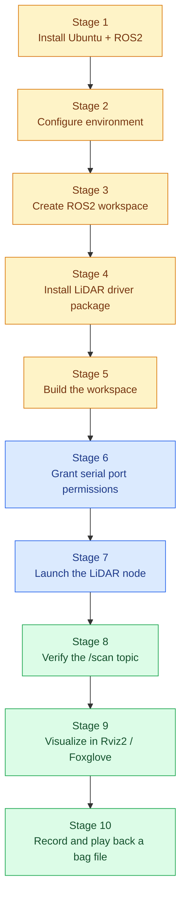
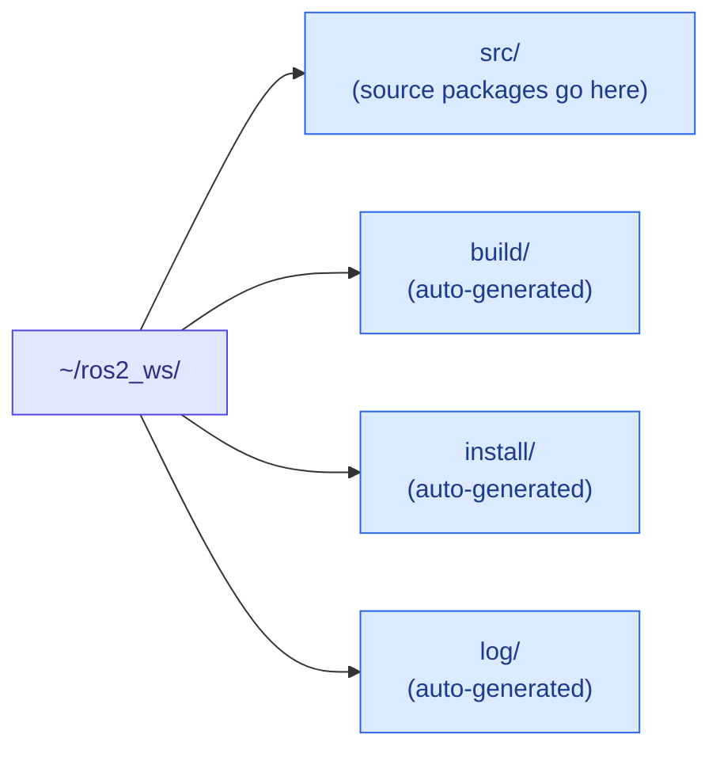
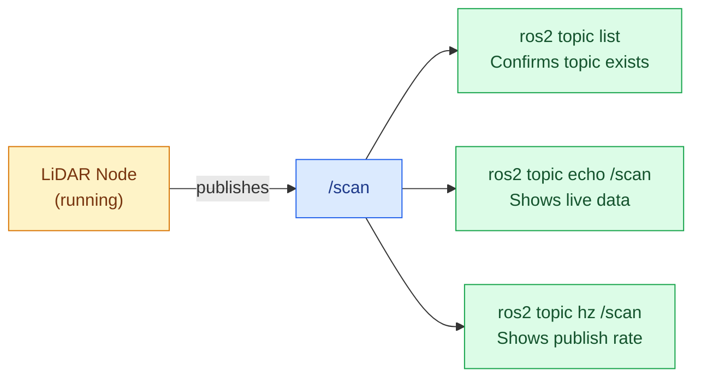
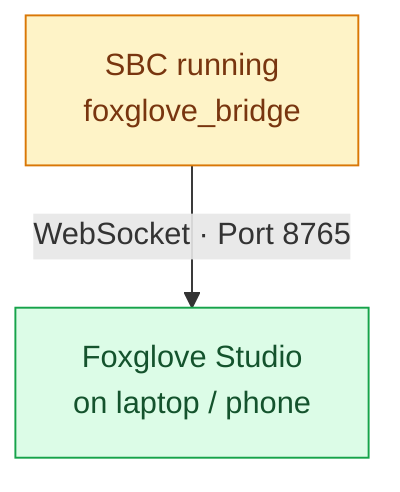

# ROS Full Setup & Execution Workflow — 2D LiDAR Pipeline

This document is a complete, start-to-finish guide for setting up ROS2 on a companion computer, connecting a 2D LiDAR, and running the full pipeline — from a fresh operating system to a working, recordable `/scan` topic visualized in Rviz2 / Foxglove Studio. Following this guide in order is sufficient to reproduce the entire setup without prior ROS experience.

**Target platform:** Raspberry Pi (or any SBC/PC) running Ubuntu, paired with a 2D LiDAR (RPLidar / YDLiDAR).
**ROS Version used in this guide:** ROS2 Humble (Ubuntu 22.04). Commands are noted where ROS2 Jazzy (Ubuntu 24.04) differs.

---

## 1. End-to-End Pipeline



---

## 2. Prerequisites

| Requirement | Detail |
|:---|:---|
| Hardware | SBC/PC (e.g. Raspberry Pi 4/5) + 2D LiDAR (RPLidar A1/A2/C1 or YDLiDAR) via USB |
| Operating System | Ubuntu 22.04 LTS (for ROS2 Humble) or Ubuntu 24.04 LTS (for ROS2 Jazzy) |
| Disk space | Minimum 10 GB free |
| Internet access | Required for installation |
| User privileges | `sudo` access |

Check your Ubuntu version before starting:

```bash
lsb_release -a
```

---

## 3. Stage 1 — Install ROS2

**Step 1.1 — Set locale**

```bash
sudo apt update && sudo apt install locales
sudo locale-gen en_US en_US.UTF-8
sudo update-locale LC_ALL=en_US.UTF-8 LANG=en_US.UTF-8
export LANG=en_US.UTF-8
```

**Step 1.2 — Enable required repositories**

```bash
sudo apt install software-properties-common
sudo add-apt-repository universe
```

**Step 1.3 — Add the ROS2 GPG key and repository**

```bash
sudo apt update && sudo apt install curl -y
sudo curl -sSL https://raw.githubusercontent.com/ros/rosdistro/master/ros.key -o /usr/share/keyrings/ros-archive-keyring.gpg
echo "deb [arch=$(dpkg --print-architecture) signed-by=/usr/share/keyrings/ros-archive-keyring.gpg] http://packages.ros.org/ros2/ubuntu $(. /etc/os-release && echo $UBUNTU_CODENAME) main" | sudo tee /etc/apt/sources.list.d/ros2.list > /dev/null
```

**Step 1.4 — Install ROS2 (Desktop version — includes Rviz2)**

```bash
sudo apt update
sudo apt upgrade
sudo apt install ros-humble-desktop -y
```

> Replace `ros-humble-desktop` with `ros-jazzy-desktop` if using Ubuntu 24.04.
> On a headless SBC (no display), you can instead install `ros-humble-ros-base` to save space — Rviz2 will not be available locally, but Foxglove Studio (Stage 9) still works remotely.

**Step 1.5 — Install developer tools**

```bash
sudo apt install ros-dev-tools -y
```

---

## 4. Stage 2 — Configure the Environment

ROS2 must be "sourced" into every terminal session before its commands become available.

**Step 2.1 — Source manually (per terminal session)**

```bash
source /opt/ros/humble/setup.bash
```

**Step 2.2 — Automate sourcing (recommended)**

```bash
echo "source /opt/ros/humble/setup.bash" >> ~/.bashrc
source ~/.bashrc
```

**Step 2.3 — Verify installation**

```bash
ros2 doctor
```

A working installation returns no critical errors.

---

## 5. Stage 3 — Create a ROS2 Workspace

A workspace is a dedicated folder where your project's packages live and get built.

```bash
mkdir -p ~/ros2_ws/src
cd ~/ros2_ws
colcon build
```



---

## 6. Stage 4 — Install the LiDAR Driver Package

Clone the appropriate driver into your workspace's `src` folder.

**For RPLidar:**

```bash
cd ~/ros2_ws/src
git clone https://github.com/Slamtec/rplidar_ros.git -b ros2
```

**For YDLidar:**

```bash
cd ~/ros2_ws/src
git clone https://github.com/YDLIDAR/ydlidar_ros2_driver.git
```

---

## 7. Stage 5 — Build the Workspace

```bash
cd ~/ros2_ws
rosdep install --from-paths src --ignore-src -r -y
colcon build --symlink-install
```

Source the newly built workspace:

```bash
source ~/ros2_ws/install/setup.bash
echo "source ~/ros2_ws/install/setup.bash" >> ~/.bashrc
```

---

## 8. Stage 6 — Grant Serial Port Permissions

The LiDAR connects over a USB serial port. Grant your user account access once, then reboot.

```bash
sudo usermod -a -G dialout $USER
sudo reboot
```

Confirm the LiDAR's port after reboot:

```bash
ls /dev/ttyUSB*
```

---

## 9. Stage 7 — Launch the LiDAR Node

**RPLidar (A1/A2):**

```bash
ros2 launch rplidar_ros rplidar_a2m8_launch.py serial_port:=/dev/ttyUSB0
```

**RPLidar (C1):**

```bash
ros2 launch rplidar_ros rplidar_c1_launch.py serial_port:=/dev/ttyUSB0
```

**YDLidar:**

```bash
ros2 launch ydlidar_ros2_driver ydlidar_launch.py
```

A successful launch prints continuous status messages and does not exit. Leave this terminal running — open a new terminal (Ctrl+Alt+T) for the remaining steps.

---

## 10. Stage 8 — Verify the `/scan` Topic

In a **new terminal** (remember to source ROS2 again, or rely on the `.bashrc` automation from Stage 2):

```bash
ros2 topic list
```

Confirm `/scan` appears in the list, then inspect live data:

```bash
ros2 topic echo /scan
```

Check the publishing rate:

```bash
ros2 topic hz /scan
```



---

## 11. Stage 9 — Visualize the Data

### Option A — Rviz2 (local display required)

```bash
rviz2
```

In the Rviz2 window:
1. Set **Fixed Frame** (top-left panel) to `laser` or `laser_frame`.
2. Click **Add** → **By topic** → select `/scan` → **LaserScan**.

### Option B — Foxglove Studio (remote / headless-friendly)

Install the Foxglove bridge on the SBC:

```bash
sudo apt install ros-humble-foxglove-bridge -y
ros2 launch foxglove_bridge foxglove_bridge_launch.xml
```

On your laptop/phone, open Foxglove Studio and connect to:

```
ws://<SBC_IP_ADDRESS>:8765
```



---

## 12. Stage 10 — Record and Play Back a Bag File

With the LiDAR node still running (Stage 7), open another terminal and record:

```bash
cd ~/ros2_ws
ros2 bag record /scan -o lidar_test_run
```

Press **Ctrl+C** to stop recording. Play it back at any time:

```bash
ros2 bag play lidar_test_run
```

Inspect its contents:

```bash
ros2 bag info lidar_test_run
```

> For SLAM work, record `/scan` together with `/tf` and `/odom` in the same command: `ros2 bag record /scan /tf /odom -o lidar_test_run`

---

## 13. Full Command Sequence (Copy-Paste Reference)

```bash
# --- One-time setup ---
sudo apt update && sudo apt install ros-humble-desktop ros-dev-tools -y
echo "source /opt/ros/humble/setup.bash" >> ~/.bashrc
source ~/.bashrc

mkdir -p ~/ros2_ws/src
cd ~/ros2_ws/src
git clone https://github.com/Slamtec/rplidar_ros.git -b ros2
cd ~/ros2_ws
rosdep install --from-paths src --ignore-src -r -y
colcon build --symlink-install
echo "source ~/ros2_ws/install/setup.bash" >> ~/.bashrc
source ~/.bashrc

sudo usermod -a -G dialout $USER
sudo reboot

# --- Every time you run the pipeline ---
ros2 launch rplidar_ros rplidar_a2m8_launch.py serial_port:=/dev/ttyUSB0   # Terminal 1
ros2 topic echo /scan                                                     # Terminal 2 (verify)
rviz2                                                                      # Terminal 3 (visualize)
ros2 bag record /scan -o lidar_test_run                                   # Terminal 4 (record)
```

---

## 14. Troubleshooting

| Issue | Cause | Fix |
|:---|:---|:---|
| `ros2: command not found` | ROS2 not sourced in this terminal | `source /opt/ros/humble/setup.bash` (or check `.bashrc` was updated) |
| `colcon build` fails with missing dependencies | Package dependencies not installed | `rosdep install --from-paths src --ignore-src -r -y` |
| `/scan` topic not listed | LiDAR node not running, or crashed on launch | Check Stage 7 terminal for errors; confirm LiDAR is powered and connected |
| `Permission denied` on serial port | User not in `dialout` group | `sudo usermod -a -G dialout $USER`, then reboot |
| Rviz2 shows nothing | Fixed Frame not set to match LiDAR's `frame_id` | Set Fixed Frame to `laser` or `laser_frame` |
| Foxglove Studio can't connect | Bridge not running, or firewall blocking port 8765 | Confirm `foxglove_bridge` is running; check SBC firewall rules |
| `colcon build` not found | Build tools not installed | `sudo apt install ros-dev-tools -y` |

---

## 15. Quick Reference

| Task | Command |
|:---|:---|
| Source ROS2 | `source /opt/ros/humble/setup.bash` |
| Build workspace | `colcon build --symlink-install` |
| Launch RPLidar node | `ros2 launch rplidar_ros rplidar_a2m8_launch.py serial_port:=/dev/ttyUSB0` |
| List active topics | `ros2 topic list` |
| View live scan data | `ros2 topic echo /scan` |
| Check publish rate | `ros2 topic hz /scan` |
| Open Rviz2 | `rviz2` |
| Launch Foxglove bridge | `ros2 launch foxglove_bridge foxglove_bridge_launch.xml` |
| Record a bag | `ros2 bag record /scan -o lidar_test_run` |
| Play back a bag | `ros2 bag play lidar_test_run` |
| Inspect a bag | `ros2 bag info lidar_test_run` |

---

## Summary

- This guide covers the complete path from a fresh Ubuntu install to a working, recordable LiDAR pipeline in ROS2.
- ROS2 must be sourced in every new terminal — automating this via `.bashrc` avoids repeated manual steps.
- The LiDAR driver is built as a package inside a dedicated `colcon` workspace, not installed system-wide.
- Serial port permissions (`dialout` group) must be granted once before the LiDAR node can connect.
- Data can be visualized locally with Rviz2 or remotely with Foxglove Studio, and recorded to a bag file for later replay or SLAM processing.

---

## Author & License

**© 2026 Arisudan. All rights reserved.**

This documentation and the accompanying workflow are authored and maintained by **Arisudan**.
GitHub: [github.com/Arisudan](https://github.com/Arisudan)

If this documentation helped you, consider giving the repository a **⭐ star** or a **🍴 fork** — it helps others discover the project and supports continued work on it.
