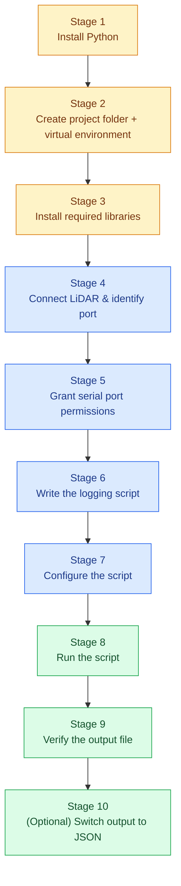
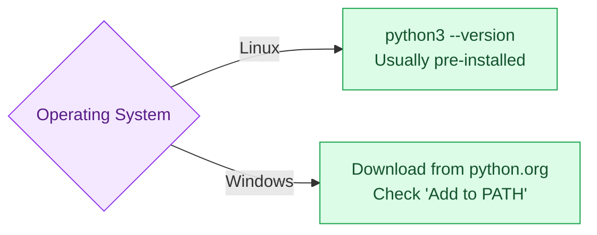
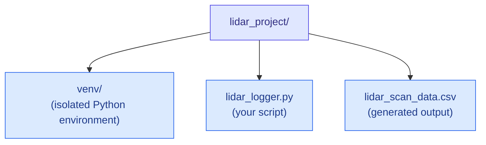
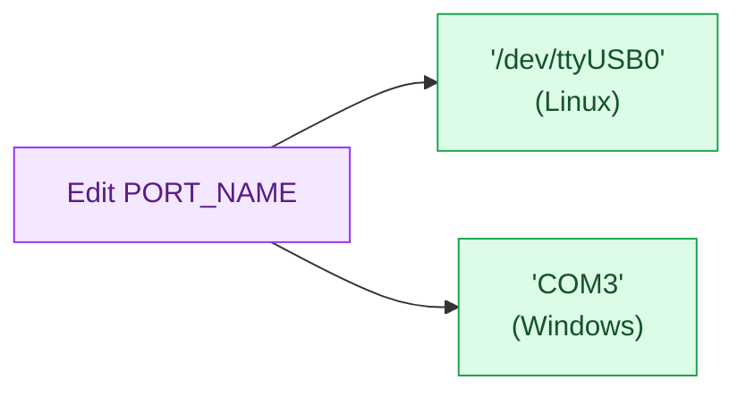
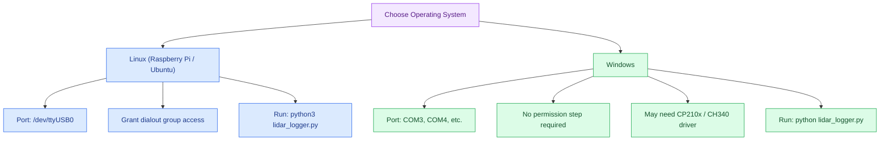

# Custom Python Code - Full Setup & Execution Workflow (2D LiDAR)

This document is a complete, start-to-finish guide for setting up and running the **Custom Python Code method** for capturing 2D LiDAR data — no ROS required. It covers everything from installing Python on a fresh operating system to a fully working, verified data-logging pipeline. Following this guide in order is sufficient to reproduce the entire setup without prior Python or robotics experience.

**Target platform:** Any SBC or PC (Raspberry Pi, Ubuntu, or Windows) paired with a 2D LiDAR (RPLidar / YDLiDAR) over USB.
**Output formats covered:** CSV (primary) and JSON (for web-based applications).

---

## 1. End-to-End Pipeline



---

## 2. Prerequisites

| Requirement | Detail |
|:---|:---|
| Hardware | SBC/PC + 2D LiDAR (RPLidar A1/A2/C1 or YDLiDAR) via USB |
| Operating System | Windows 10/11, Ubuntu, or Raspberry Pi OS |
| Python | Version 3.7 or later |
| Internet access | Required for package installation |
| Permissions | `sudo` access (Linux only) |

---

## 3. Stage 1 — Install Python

### Linux (Ubuntu / Raspberry Pi OS)

Python 3 is typically pre-installed. Confirm and install `pip` and `venv` support:

```bash
python3 --version
sudo apt update
sudo apt install python3 python3-pip python3-venv -y
```

### Windows

1. Download the installer from [python.org/downloads](https://www.python.org/downloads/).
2. Run the installer and **check "Add python.exe to PATH"** before clicking Install.
3. Confirm installation in Command Prompt:

```bash
python --version
pip --version
```



---

## 4. Stage 2 — Create the Project Folder and Virtual Environment

A virtual environment keeps this project's libraries isolated from the rest of the system — recommended for a clean, reproducible setup.

**Linux:**

```bash
mkdir -p ~/lidar_project
cd ~/lidar_project
python3 -m venv venv
source venv/bin/activate
```

**Windows:**

```bash
mkdir lidar_project
cd lidar_project
python -m venv venv
venv\Scripts\activate
```

> Once activated, your terminal prompt will show `(venv)` at the start of the line. All following steps assume the virtual environment is active. Deactivate anytime with `deactivate`.



---

## 5. Stage 3 — Install Required Libraries

Two libraries are required: `pyserial` (serial communication) and `rplidar-roboticia` (LiDAR driver).

**Linux (inside the activated venv):**

```bash
pip install pyserial rplidar-roboticia
```

**Windows (inside the activated venv):**

```bash
pip install pyserial rplidar-roboticia
```

> If not using a virtual environment on Raspberry Pi OS / Debian, you may see an "externally managed environment" error. In that case only, use:
> ```bash
> pip install pyserial rplidar-roboticia --break-system-packages
> ```

---

## 6. Stage 4 — Connect the LiDAR and Identify the Port

Connect the LiDAR to the SBC/PC via its USB adapter cable.

| OS | Typical Port Name | How to Check |
|:---|:---|:---|
| Linux | `/dev/ttyUSB0` | `ls /dev/ttyUSB*` |
| Windows | `COM3`, `COM4`, etc. | Device Manager → Ports (COM & LPT) |

> **Windows-specific note:** If the LiDAR does not appear in Device Manager at all, install the USB-to-serial chip driver first (CP2102 is common on RPLidar units) — usually a free download from the chip manufacturer's website.

---

## 7. Stage 5 — Grant Serial Port Permissions (Linux Only)

```bash
sudo usermod -a -G dialout $USER
sudo reboot
```

This step is **not required on Windows** — serial access is granted by default.

---

## 8. Stage 6 — Write the Logging Script

Inside your project folder, create a file named `lidar_logger.py`:

```python
import csv
import time
import sys
from rplidar import RPLidar, RPLidarException

# --- CONFIGURATION ---
# Linux: '/dev/ttyUSB0'   |   Windows: 'COM3', 'COM4', etc.
PORT_NAME = '/dev/ttyUSB0'
OUTPUT_FILE = 'lidar_scan_data.csv'

def run_lidar_logger():
    # Initialize the LiDAR connection
    print(f"Connecting to LiDAR on port {PORT_NAME}...")
    try:
        lidar = RPLidar(PORT_NAME)
        info = lidar.get_info()
        print(f"Connected successfully! Device Info: {info}")
    except Exception as e:
        print(f"Failed to connect to LiDAR: {e}")
        sys.exit(1)

    # Open the CSV file and write the headers
    print(f"Saving scan logs to '{OUTPUT_FILE}'. Press Ctrl+C to stop.")
    with open(OUTPUT_FILE, mode='w', newline='') as file:
        writer = csv.writer(file)

        # Write CSV columns based on core 2D LiDAR parameters
        writer.writerow(['Timestamp', 'Scan_ID', 'Quality', 'Angle_Degrees', 'Distance_Meters'])

        scan_counter = 0
        try:
            # iter_scans() yields a full 360-degree rotation array per iteration
            for scan in lidar.iter_scans():
                scan_counter += 1
                current_time = time.time()  # Grab exact Unix timestamp

                # Loop through each individual laser point in the 360-degree scan array
                for (quality, angle, distance) in scan:
                    # Ignore invalid zero readings or out-of-range sensor noise
                    if distance > 0:
                        # Convert millimeters (standard LiDAR raw output) to meters
                        distance_meters = distance / 1000.0

                        # Append the parsed data point straight into our flat row CSV file
                        writer.writerow([
                            f"{current_time:.4f}",     # Precise time
                            scan_counter,              # Group ID for this rotation loop
                            quality,                   # Signal strength (0-15 or 0-63)
                            f"{angle:.2f}",            # Angular heading in degrees
                            f"{distance_meters:.3f}"   # Normalized range in meters
                        ])

                # Flush internal buffer periodically so data saves progressively
                if scan_counter % 5 == 0:
                    file.flush()
                    print(f"Logged {scan_counter} complete rotations...", end='\r')

        except KeyboardInterrupt:
            print("\nRecording stopped by user via Ctrl+C.")
        except RPLidarException as re:
            print(f"\nLiDAR hardware exception encountered: {re}")
        finally:
            # Crucial cleanup: Always gracefully stop the spinning motor and release serial locks
            print("Stopping motor and disconnecting device cleanly...")
            lidar.stop()
            lidar.stop_motor()
            lidar.disconnect()

if __name__ == '__main__':
    run_lidar_logger()
```

---

## 9. Stage 7 — Configure the Script

Open `lidar_logger.py` and update one line to match your system:

```python
PORT_NAME = '/dev/ttyUSB0'   # Linux example
# PORT_NAME = 'COM3'         # Windows example
```



---

## 10. Stage 8 — Run the Script

**Linux:**

```bash
python3 lidar_logger.py
```

**Windows:**

```bash
python lidar_logger.py
```

Expected console output on success:

```
Connecting to LiDAR on port /dev/ttyUSB0...
Connected successfully! Device Info: {...}
Saving scan logs to 'lidar_scan_data.csv'. Press Ctrl+C to stop.
Logged 5 complete rotations...
```

Press **Ctrl+C** at any time to stop. The script stops the LiDAR motor and closes the connection cleanly before exiting.

---

## 11. Stage 9 — Verify the Output

A file named `lidar_scan_data.csv` will appear in the project folder. Each row is one measured point.

| Timestamp | Scan_ID | Quality | Angle_Degrees | Distance_Meters |
|:---|:---:|:---:|:---:|:---:|
| 1718223541.1042 | 1 | 15 | 0.42 | 1.245 |
| 1718223541.1042 | 1 | 15 | 1.15 | 1.251 |
| 1718223541.2215 | 2 | 14 | 0.05 | 1.242 |

| Column | Meaning |
|:---|:---|
| `Timestamp` | Unix time the point was recorded |
| `Scan_ID` | Groups all points belonging to the same 360° rotation |
| `Quality` | Signal strength of the return (higher is more reliable) |
| `Angle_Degrees` | Heading of the beam at time of measurement |
| `Distance_Meters` | Measured distance, converted from mm to meters |

---

## 12. Stage 10 — (Optional) Switch Output to JSON

For web-based robotic applications, replace the CSV-writing block with the JSON equivalent below.

```python
import json
import time
import sys
from rplidar import RPLidar, RPLidarException

PORT_NAME = '/dev/ttyUSB0'
OUTPUT_FILE = 'lidar_scan_data.json'

def run_lidar_logger_json():
    print(f"Connecting to LiDAR on port {PORT_NAME}...")
    try:
        lidar = RPLidar(PORT_NAME)
        info = lidar.get_info()
        print(f"Connected successfully! Device Info: {info}")
    except Exception as e:
        print(f"Failed to connect to LiDAR: {e}")
        sys.exit(1)

    all_scans = []
    scan_counter = 0
    print(f"Saving scan logs to '{OUTPUT_FILE}'. Press Ctrl+C to stop.")
    try:
        for scan in lidar.iter_scans():
            scan_counter += 1
            current_time = time.time()
            points = []
            for (quality, angle, distance) in scan:
                if distance > 0:
                    points.append({
                        "quality": quality,
                        "angle_degrees": round(angle, 2),
                        "distance_meters": round(distance / 1000.0, 3)
                    })
            all_scans.append({
                "scan_id": scan_counter,
                "timestamp": round(current_time, 4),
                "points": points
            })
            if scan_counter % 5 == 0:
                print(f"Logged {scan_counter} complete rotations...", end='\r')
    except KeyboardInterrupt:
        print("\nRecording stopped by user via Ctrl+C.")
    except RPLidarException as re:
        print(f"\nLiDAR hardware exception encountered: {re}")
    finally:
        print("Stopping motor and disconnecting device cleanly...")
        lidar.stop()
        lidar.stop_motor()
        lidar.disconnect()

        with open(OUTPUT_FILE, 'w') as file:
            json.dump(all_scans, file, indent=2)
        print(f"Saved {scan_counter} scans to '{OUTPUT_FILE}'.")

if __name__ == '__main__':
    run_lidar_logger_json()
```

Resulting JSON structure:

```json
[
  {
    "scan_id": 1,
    "timestamp": 1718223541.1042,
    "points": [
      { "quality": 15, "angle_degrees": 0.42, "distance_meters": 1.245 },
      { "quality": 15, "angle_degrees": 1.15, "distance_meters": 1.251 }
    ]
  }
]
```

---

## 13. Windows vs Linux Execution



| Aspect | Linux (Pi / Ubuntu) | Windows |
|:---|:---|:---|
| Port name | `/dev/ttyUSB0` | `COM3`, `COM4`, etc. |
| Finding the port | `ls /dev/ttyUSB*` | Device Manager → Ports (COM & LPT) |
| Permissions | `sudo usermod -a -G dialout $USER` + reboot | Not required |
| USB driver | Usually built into the kernel | May require CP210x / CH340 driver |
| Create venv | `python3 -m venv venv` | `python -m venv venv` |
| Activate venv | `source venv/bin/activate` | `venv\Scripts\activate` |
| Install libraries | `pip install pyserial rplidar-roboticia` | `pip install pyserial rplidar-roboticia` |
| Run script | `python3 lidar_logger.py` | `python lidar_logger.py` |

---

## 14. Full Command Sequence (Copy-Paste Reference)

**Linux:**

```bash
# --- One-time setup ---
sudo apt update && sudo apt install python3 python3-pip python3-venv -y
mkdir -p ~/lidar_project && cd ~/lidar_project
python3 -m venv venv
source venv/bin/activate
pip install pyserial rplidar-roboticia
sudo usermod -a -G dialout $USER
sudo reboot

# --- Every time you run the pipeline ---
cd ~/lidar_project
source venv/bin/activate
python3 lidar_logger.py
```

**Windows:**

```bash
:: --- One-time setup ---
mkdir lidar_project && cd lidar_project
python -m venv venv
venv\Scripts\activate
pip install pyserial rplidar-roboticia

:: --- Every time you run the pipeline ---
cd lidar_project
venv\Scripts\activate
python lidar_logger.py
```

---

## 15. Troubleshooting

| Issue | Cause | Fix |
|:---|:---|:---|
| `python3: command not found` | Python not installed or not on PATH | Reinstall and confirm "Add to PATH" (Windows) or install via `apt` (Linux) |
| `Permission denied` on serial port | User not in `dialout` group | `sudo usermod -a -G dialout $USER`, then reboot |
| Connection fails / garbled data | Incorrect baudrate for the LiDAR model | RPLidar A1 uses `115200` (default); A2/C1 require `RPLidar(PORT_NAME, baudrate=256000)` |
| `FileNotFoundError` / port not found | Incorrect `PORT_NAME`, or device not detected | Re-check with `ls /dev/ttyUSB*` (Linux) or Device Manager (Windows) |
| `externally managed environment` error | Installing globally on Debian/Raspberry Pi OS without a venv | Use a virtual environment (Stage 2), or add `--break-system-packages` |
| Script exits immediately | LiDAR not powered or motor not spinning | Confirm USB power delivery and physical connection |
| Windows: device not in Device Manager | Missing USB-to-serial chip driver | Install CP210x / CH340 driver from chip manufacturer |

---

## 16. Quick Reference

| Task | Linux | Windows |
|:---|:---|:---|
| Create virtual environment | `python3 -m venv venv` | `python -m venv venv` |
| Activate virtual environment | `source venv/bin/activate` | `venv\Scripts\activate` |
| Install dependencies | `pip install pyserial rplidar-roboticia` | `pip install pyserial rplidar-roboticia` |
| Check serial port | `ls /dev/ttyUSB*` | Device Manager |
| Grant port permission | `sudo usermod -a -G dialout $USER` | Not required |
| Run the logger | `python3 lidar_logger.py` | `python lidar_logger.py` |
| Stop recording | `Ctrl+C` | `Ctrl+C` |

---

## Summary

- This workflow reads LiDAR data directly over a serial connection using plain Python — no ROS installation required.
- A virtual environment keeps dependencies isolated and the setup reproducible across machines.
- Only two libraries are required: `pyserial` and `rplidar-roboticia`.
- The same script logic can output either CSV (flat, spreadsheet-friendly) or JSON (structured, web-friendly) depending on the use case.
- Linux requires a one-time `dialout` group permission grant; Windows does not.

---

## Author & License

**© 2026 Arisudan. All rights reserved.**

This documentation and the accompanying workflow are authored and maintained by **Arisudan**.
GitHub: [github.com/Arisudan](https://github.com/Arisudan)

If this documentation helped you, consider giving the repository a **⭐ star** or a **🍴 fork** — it helps others discover the project and supports continued work on it.
