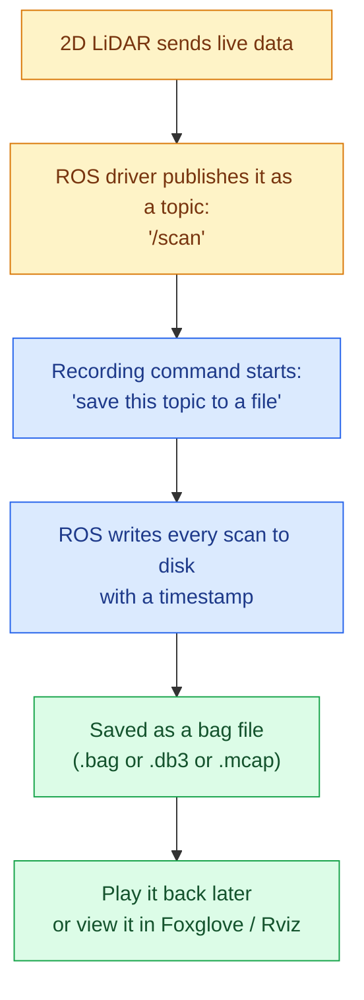

# ROS Recording Workflow

---

In simple terms: the LiDAR does not save a file by itself. ROS "listens" to the LiDAR's live data and writes it to disk step by step. Here is that process in plain language:

1. **The LiDAR driver starts running** and begins broadcasting live scan data on a channel called a *topic* — usually named `/scan`. At this point, nothing is saved yet; it is only live data flowing in memory.
2. **A recording command is run** to tell ROS "start saving everything on this topic to a file."
3. **ROS writes each scan to disk** as it arrives, along with the exact time it was received.
4. **The result is a bag file** — a container that holds every scan in order, ready to be replayed later exactly as it happened.
5. **The bag can be played back** anytime, as if the LiDAR were live again, or opened in a viewer like Foxglove Studio.



### Which File Format Do You Get?

| ROS Version | Command | What You Get |
|:---|:---|:---|
| ROS1 | `rosbag record /scan` | One `.bag` file |
| ROS2 (default) | `ros2 bag record /scan` | A folder with a `.db3` file + a `metadata.yaml` |
| ROS2 (MCAP) | `ros2 bag record /scan -s mcap` | One `.mcap` file (works outside ROS too, opens directly in Foxglove) |

### What Is Actually Stored Inside the File?

For every single scan message, the file keeps:
- **Which topic it came from** (e.g. `/scan`)
- **What type of data it is** (`sensor_msgs/LaserScan`)
- **The scan itself** (distances, angles, etc.)
- **The exact time it was received**

### Recording More Than Just the LiDAR

Real SLAM work usually needs the LiDAR data *together with* the robot's position data, so they can both be recorded at once:

```bash
ros2 bag record /scan /tf /odom -o my_slam_run
```

### Common Commands Quick Reference

| Task | Command |
|:---|:---|
| Start recording | `ros2 bag record /scan` |
| Replay a recording | `ros2 bag play my_slam_run` |
| Inspect what's inside | `ros2 bag info my_slam_run` |
| Convert `.db3` to `.mcap` | `ros2 bag convert -i my_slam_run -o output.yaml` |

---

*Digitized from handwritten lab notebook for GitHub reference.*
