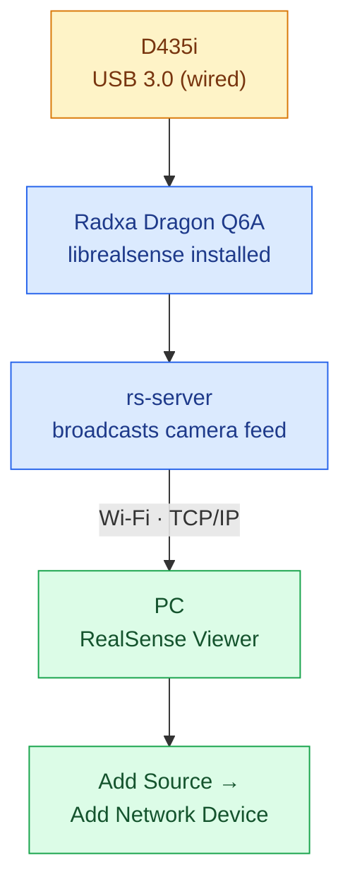
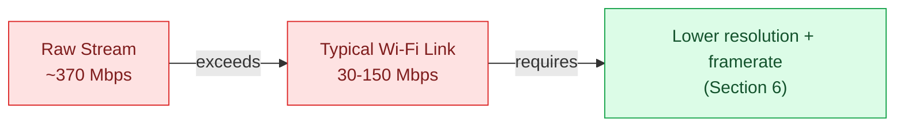
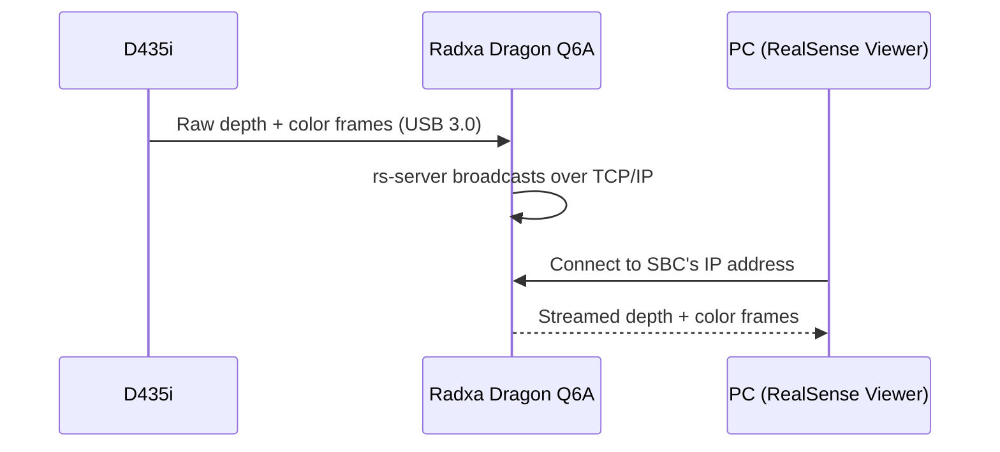
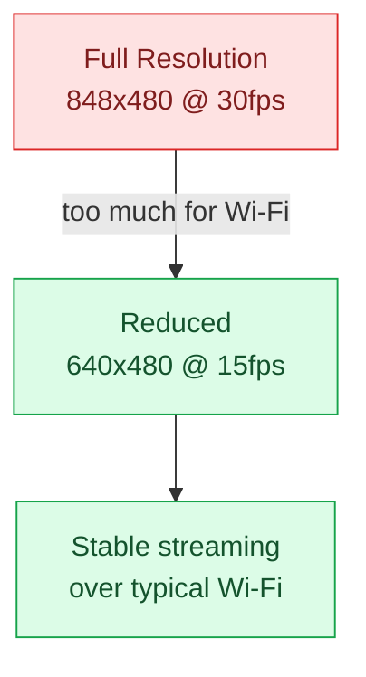
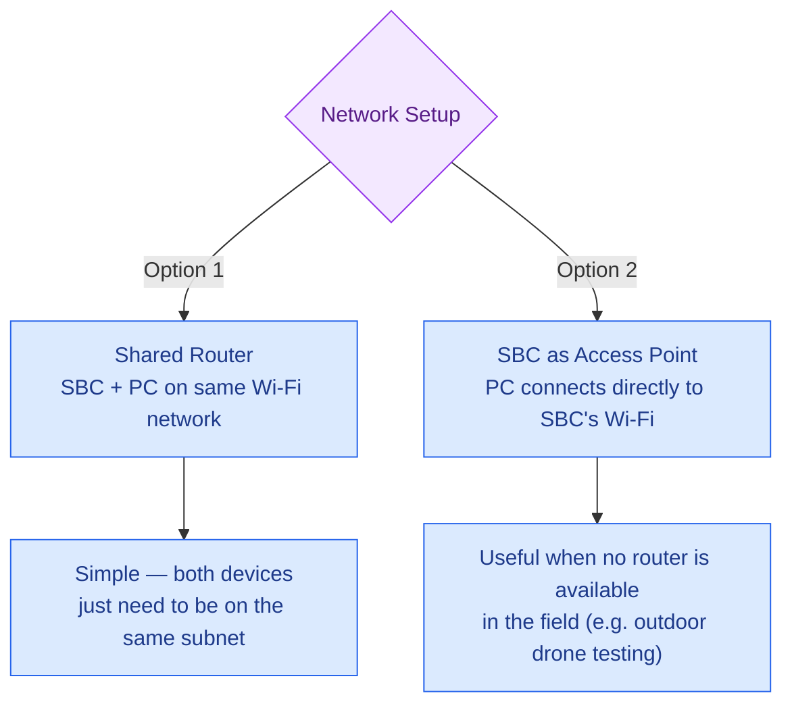

# RealSense D435i Wireless Streaming — Path A: `rs-server` + RealSense Viewer

This document covers **Path A**: streaming the Intel RealSense D435i from a Radxa Dragon Q6A (or any SBC) to a PC over Wi-Fi using librealsense's built-in network server (`rs-server`) and the RealSense Viewer. This path does **not** use ROS — it relies entirely on the RealSense SDK's own networking feature.

**Use this path if:** you only need to view/record the raw depth and color streams remotely, without ROS topics, Rviz2, or bag files.
**Use Path B instead if:** this camera feeds into your existing ROS2-based LiDAR pipeline (recommended for this repository).

---

## 1. Overview



---

## 2. Prerequisites

| Requirement | Detail |
|:---|:---|
| Hardware | Intel RealSense D435i, Radxa Dragon Q6A (or SBC), USB 3.0/3.1 port (mandatory — USB 2.0 severely limits stream quality) |
| Network | SBC and PC on the same Wi-Fi network/subnet, or SBC configured as a Wi-Fi Access Point |
| Software (SBC) | Ubuntu/Linux with librealsense SDK compiled, including `rs-server` |
| Software (PC) | Intel RealSense Viewer installed |

> **USB 3.0 is mandatory.** The D435i drops into a severely limited mode over USB 2.0 (lower resolution, lower framerate, degraded depth quality). Confirm the SBC's port is genuinely USB 3.0/3.1, not just USB-C shaped.

---

## 3. Bandwidth Reality Check

Before starting, understand the physical ceiling this path is working against.

| Stream | Resolution | Uncompressed Bitrate |
|:---|:---|:---|
| Depth (16-bit) | 640×480 @ 30fps | ~147 Mbps |
| Color (RGB) | 640×480 @ 30fps | ~221 Mbps |
| **Combined, raw** | — | **~370 Mbps** |

A typical Wi-Fi link — especially at range or through obstructions — realistically delivers **30–150 Mbps** of usable throughput. Streaming both feeds at full resolution/framerate will saturate the link and cause stuttering or dropped frames. Lowering resolution and framerate (Section 6) is not optional polish — it is required to make this path usable.



---

## 4. Stage 1 — Install librealsense on the SBC

```bash
sudo apt update
sudo apt install -y software-properties-common
sudo apt-key adv --keyserver keyserver.ubuntu.com --recv-key F6E65AC044F831AC80A06380C8B3A55A6F3EFCDE
sudo add-apt-repository "deb https://librealsense.intel.com/Debian/apt-repo $(lsb_release -cs) main"
sudo apt update
sudo apt install -y librealsense2-dkms librealsense2-utils librealsense2-dev
```

Verify the camera is detected once connected via USB 3.0:

```bash
rs-enumerate-devices
```

---

## 5. Stage 2 — Connect the Camera and Start the Server

**Step 5.1 — Physically connect** the D435i to the SBC's USB 3.0 port using the official USB-C cable.

**Step 5.2 — Confirm the SBC's local IP address:**

```bash
ip a
```

Note the IP under the active Wi-Fi/Ethernet interface (e.g. `192.168.1.42`).

**Step 5.3 — Start the network server:**

```bash
rs-server
```

Leave this terminal running — it broadcasts the camera feed over TCP/IP as long as the process is active.



---

## 6. Stage 3 — Connect from the PC

**Step 6.1 — Install** the Intel RealSense Viewer on your PC if not already installed.

**Step 6.2 — Open RealSense Viewer** → side panel → **Add Source** → **Add Network Device**.

**Step 6.3 — Enter the SBC's IP address** (from Step 5.2) and confirm.

**Step 6.4 — Toggle streams** — Depth and Color feeds will appear as if the camera were plugged directly into your PC.

### Reducing Bandwidth (Recommended)

| Setting | Recommended Value for Wi-Fi |
|:---|:---|
| Resolution | 640×480 (or lower, e.g. 424×240) |
| Framerate | 15 fps |
| Streams active | Enable only what you need (e.g. Depth only, if Color isn't required) |



---

## 7. Network Setup Options



Setting up the SBC as a standalone Access Point is a separate networking configuration (`hostapd` + `dnsmasq` on Linux) and is out of scope for this document — use this option only if a shared router isn't available.

---

## 8. Quick Reference

| Task | Command |
|:---|:---|
| Install librealsense SDK | `sudo apt install -y librealsense2-dkms librealsense2-utils librealsense2-dev` |
| Verify camera detected | `rs-enumerate-devices` |
| Check SBC IP address | `ip a` |
| Start network server | `rs-server` |

---

## 9. Troubleshooting

| Issue | Cause | Fix |
|:---|:---|:---|
| Camera not detected by `rs-enumerate-devices` | USB 2.0 port, or loose connection | Confirm genuine USB 3.0/3.1 port and cable |
| PC can't connect to Network Device | Wrong IP address, or devices on different subnets | Re-check `ip a` output; confirm both devices on same network |
| Stream stutters / drops frames | Bandwidth saturation | Lower resolution/framerate (Section 6); disable unused streams |
| `rs-server` command not found | librealsense not fully installed | Reinstall via the official repo (Section 4); confirm `librealsense2-utils` is installed |
| Depth stream noisy or missing | Direct sunlight interfering with IR pattern | Test indoors first; avoid direct sunlight on the sensor |

---

## Summary

- Path A uses librealsense's own `rs-server` tool to broadcast camera data directly — no ROS involved.
- USB 3.0 is mandatory between the camera and the SBC; Wi-Fi is only used for the SBC-to-PC leg.
- Raw depth + color streams (~370 Mbps combined) exceed typical Wi-Fi throughput — resolution and framerate must be reduced for stable streaming.
- This path is best suited for quick viewing/testing, not for integration into a ROS-based robotics pipeline — use Path B for that.

---

## Author & License

<div align="center">


</div>

**© 2026 Arisudan. All Rights Reserved.**

Authored and maintained by **Arisudan** — [github.com/Arisudan](https://github.com/Arisudan)

If this documentation helped you, consider giving the repository a **⭐ star** or a **🍴 fork**.
