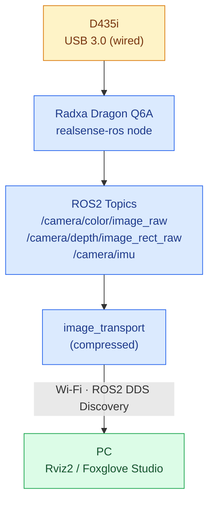
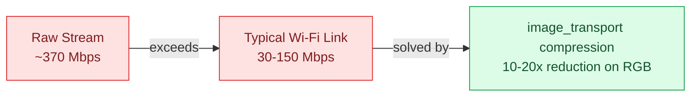
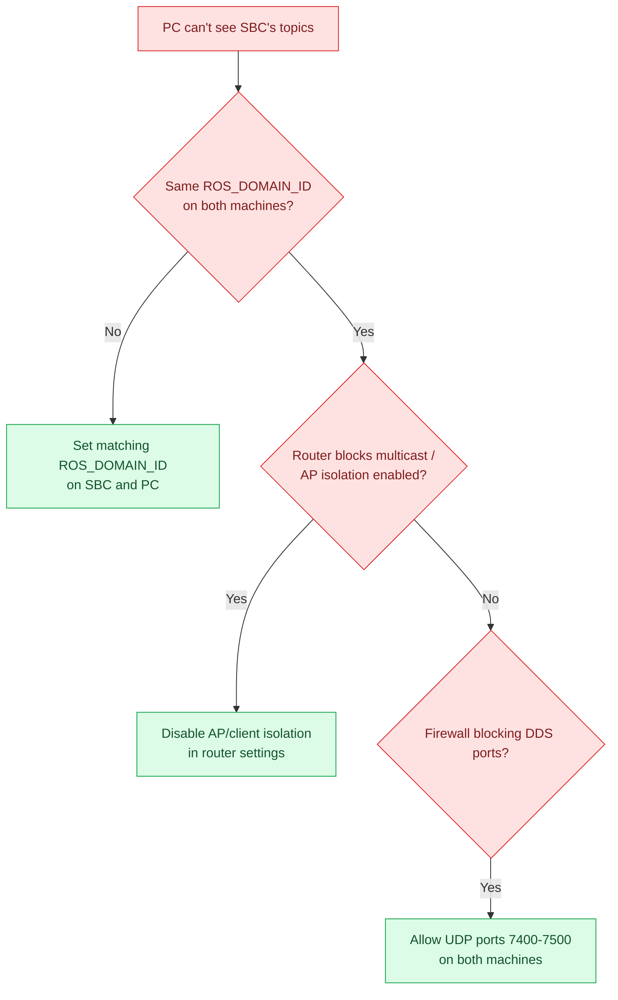

# RealSense D435i Wireless Streaming — Path B: `realsense-ros` + ROS2/DDS

This document covers **Path B**: streaming the Intel RealSense D435i from a Radxa Dragon Q6A (or any SBC) to a PC over Wi-Fi using the `realsense-ros` package and native ROS2 topic discovery (DDS). This path integrates directly with the ROS2-based pipeline already documented in this repository (LiDAR `/scan`, bag recording, Rviz2/Foxglove).

**Use this path if:** the D435i feeds into ORB-SLAM3, needs to be recorded with `ros2 bag`, or visualized in Rviz2/Foxglove alongside your LiDAR data.
**Use Path A instead if:** you only need a quick raw viewer with no ROS involvement.

---

## 1. Overview



---

## 2. Prerequisites

| Requirement | Detail |
|:---|:---|
| Hardware | Intel RealSense D435i, Radxa Dragon Q6A (or SBC), USB 3.0/3.1 port (mandatory) |
| Operating System | Ubuntu 22.04 (ROS2 Humble) or Ubuntu 24.04 (ROS2 Jazzy) on both SBC and PC |
| ROS2 | Installed on both the SBC and the PC (see this repo's ROS Full Setup document) |
| Network | SBC and PC on the same Wi-Fi network/subnet |

> **USB 3.0 is mandatory.** The D435i drops into a severely limited mode over USB 2.0. Confirm the SBC's port is genuinely USB 3.0/3.1.
> **ROS2 must be installed on both machines** — this is different from Path A, where only the SBC needs software installed.

---

## 3. Bandwidth Reality Check



Unlike Path A (which relies on manually lowering resolution), ROS2 gives you a purpose-built tool for this: `image_transport` compression plugins. This is the main structural advantage of Path B — bandwidth control is built into the framework rather than being a manual viewer setting.

---

## 4. Stage 1 — Install ROS2 and `realsense-ros` on the SBC

Assumes ROS2 Humble is already installed (see this repo's **ROS Full Setup & Execution Workflow** document). If not, complete that setup first.

```bash
sudo apt update
sudo apt install -y ros-humble-realsense2-camera ros-humble-realsense2-description
```

Verify the camera is detected:

```bash
rs-enumerate-devices
```

---

## 5. Stage 2 — Launch the Camera Node

**Step 5.1 — Connect** the D435i to the SBC's USB 3.0 port.

**Step 5.2 — Source ROS2** (if not already automated via `.bashrc`):

```bash
source /opt/ros/humble/setup.bash
```

**Step 5.3 — Launch the RealSense node:**

```bash
ros2 launch realsense2_camera rs_launch.py \
  enable_color:=true \
  enable_depth:=true \
  enable_gyro:=true \
  enable_accel:=true \
  depth_module.profile:=640x480x15 \
  rgb_camera.profile:=640x480x15
```

> The `profile` parameters set resolution and framerate directly at the source (640×480 @ 15fps) — this is the ROS2-native equivalent of the manual reduction done in Path A's viewer settings.

**Step 5.4 — Confirm topics are publishing** (new terminal):

```bash
ros2 topic list
```

Expected topics include:

```
/camera/color/image_raw
/camera/depth/image_rect_raw
/camera/imu
```

---

## 6. Stage 3 — Compress the Image Streams

```bash
ros2 run image_transport republish raw compressed \
  --ros-args -r in:=/camera/color/image_raw -r out:=/camera/color/image_raw/compressed
```


> Depth images are typically kept uncompressed (or use `compressedDepth`) since standard JPEG-style compression distorts distance values. For most use cases, compressing only the color stream and keeping depth at a reduced resolution (Section 5.3) is sufficient.

---

## 7. Stage 4 — Connect from the PC

Because ROS2 uses DDS for automatic discovery, **no manual IP entry or bridge is required** if both machines are correctly networked — this is the key difference from Path A.

**Step 7.1 — Ensure the PC has ROS2 installed** and sourced:

```bash
source /opt/ros/humble/setup.bash
```

**Step 7.2 — Confirm the PC can see the SBC's topics:**

```bash
ros2 topic list
```

**Step 7.3 — Visualize in Rviz2:**

```bash
rviz2
```

Add displays for `/camera/color/image_raw/compressed` and `/camera/depth/image_rect_raw`.

**Step 7.4 — Or visualize in Foxglove Studio:**

```bash
# On the SBC:
ros2 launch foxglove_bridge foxglove_bridge_launch.xml
```

Connect from Foxglove Studio on the PC to `ws://<SBC_IP_ADDRESS>:8765`.

---

## 8. DDS Discovery Troubleshooting



**Set a matching domain ID on both machines:**

```bash
export ROS_DOMAIN_ID=42
```

Add this line to `.bashrc` on both the SBC and the PC so it persists across sessions.

---

## 9. Quick Reference

| Task | Command |
|:---|:---|
| Install `realsense-ros` | `sudo apt install -y ros-humble-realsense2-camera` |
| Launch camera node | `ros2 launch realsense2_camera rs_launch.py enable_color:=true enable_depth:=true` |
| List active topics | `ros2 topic list` |
| Compress color stream | `ros2 run image_transport republish raw compressed --ros-args -r in:=/camera/color/image_raw -r out:=/camera/color/image_raw/compressed` |
| Set matching domain ID | `export ROS_DOMAIN_ID=42` |
| Open Rviz2 | `rviz2` |
| Launch Foxglove bridge | `ros2 launch foxglove_bridge foxglove_bridge_launch.xml` |
| Record camera + IMU data | `ros2 bag record /camera/color/image_raw/compressed /camera/depth/image_rect_raw /camera/imu -o d435i_run` |

---

## 10. Troubleshooting

| Issue | Cause | Fix |
|:---|:---|:---|
| Camera not detected | USB 2.0 port, or loose connection | Confirm genuine USB 3.0/3.1 port and cable |
| No topics published | `realsense2_camera` node crashed or not launched | Check launch terminal for errors; re-run Stage 2 |
| PC can't see SBC's topics | DDS discovery blocked | Follow Section 8 (matching `ROS_DOMAIN_ID`, router AP isolation, firewall) |
| Stream stutters / drops frames | Bandwidth saturation despite compression | Lower `profile` resolution/framerate further; disable unused streams |
| Depth image looks corrupted after compression | Standard JPEG compression applied to depth | Use `compressedDepth` transport, or leave depth uncompressed at reduced resolution |
| Foxglove Studio can't connect | Bridge not running, or firewall blocking port 8765 | Confirm `foxglove_bridge` is running; check SBC firewall rules |

---

## Summary

- Path B publishes the D435i's streams as native ROS2 topics via `realsense-ros`, integrating directly with this repository's existing LiDAR/SLAM pipeline.
- ROS2's DDS discovery removes the need for manual IP entry — but requires a matching `ROS_DOMAIN_ID` and a Wi-Fi network that doesn't block multicast.
- `image_transport` compression plugins reduce the color stream 10-20x, solving the same bandwidth problem Path A handles manually.
- This path enables direct `ros2 bag` recording and Rviz2/Foxglove visualization alongside LiDAR data — the recommended path for this repository's overall pipeline.

---

## Author & License

<div align="center">


</div>

**© 2026 Arisudan. All Rights Reserved.**

Authored and maintained by **Arisudan** — [github.com/Arisudan](https://github.com/Arisudan)

If this documentation helped you, consider giving the repository a **⭐ star** or a **🍴 fork**.
